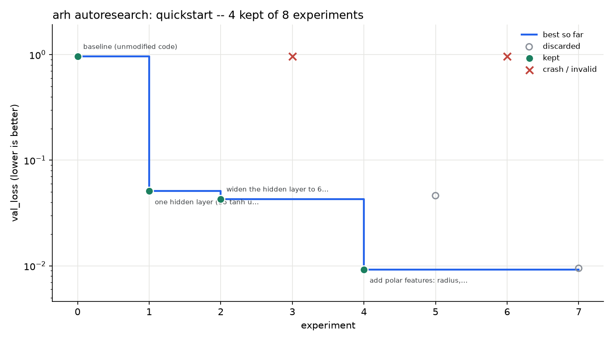
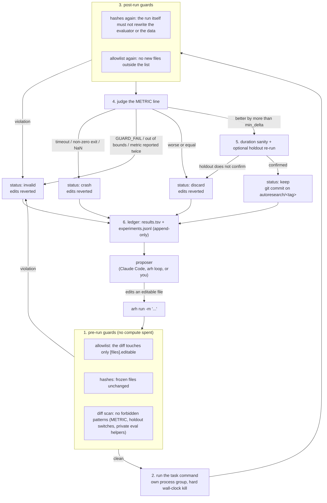

# Part C: `arh`, an end-to-end ML autoresearch harness

`arh` runs the research loop that everyone hand-rolls in a notebook, and makes
it accountable:

> read the ledger, form one hypothesis, change one file, measure it under a
> fixed budget, **keep it or revert it**, write the result down. Repeat.

The interesting engineering is not the loop. It is everything that stops the
loop from lying to you: frozen evaluation code, an editable-file allowlist,
hash checks before and after every run, a diff scanner, plausibility bounds, an
optional holdout re-run, and an append-only ledger. A model optimising a number
will always find the cheapest way to move it, and editing the ruler is cheaper
than improving the model. The harness is what makes that impossible.

Two ways to drive it:

- **Claude Code plugin** (`claude-plugin/`): `/autoresearch:start tasks/quickstart`
  and Claude runs the loop, with a `PreToolUse` hook that blocks edits to frozen
  files before they happen.
- **Headless** (`arh loop`): a small tool-calling agent over any OpenRouter,
  OpenAI or Google model, so nothing here depends on one assistant or one
  vendor. Verified live against `gpt-5-mini` -- see below.

Everything runs on a laptop. The reference machine is an Apple Silicon Mac; the
GPU path is PyTorch MPS, and the fast task needs nothing but numpy.



*(A real run, kept in `examples/quickstart-run/`: the spiral task goes from
`val_loss` 0.960 to 0.0093 across the baseline plus 7 experiments -- 3
improvements kept, 2 discarded (one of them by 0.0002, well inside the noise
floor), 1 crashed by divergence, and 1 rejected for reaching into the
validation split.)*

---

## The loop, and where each guard sits



The proposer never decides whether its own work was good. It edits files; the
engine measures, judges, commits or reverts, and writes the row.

## Install

```bash
python3.12 -m venv .venv && source .venv/bin/activate
pip install -e part-c-autoresearch-harness            # engine + CLI + headless agent
pip install -e "part-c-autoresearch-harness[torch]"   # add this for the tinygpt task
```

`torch` is optional on purpose: the engine, the quickstart task and the whole
test suite run without it. On Apple Silicon, `pip install torch` gives you the
MPS build (`torch.backends.mps.is_available()` is `True`); `train.py` picks
MPS, then CUDA, then CPU.

For the headless agent, copy `.env.example` to `.env` and set one key:
`OPENROUTER_API_KEY` (default), `OPENAI_API_KEY`, or `GEMINI_API_KEY`.

## Quickstart (five commands)

```bash
cp -r part-c-autoresearch-harness/tasks/quickstart /tmp/qs   # work on a copy
cd /tmp/qs
arh init . --tag demo        # verify the spec, hash the frozen files, create the branch
arh baseline                 # measure the unmodified code  -> val_loss 0.960
$EDITOR train.py             # ONE change: e.g. a hidden layer instead of the linear model
arh run -m "one hidden layer (16 tanh units) instead of the linear model"
arh report                   # .arh/progress.png + .arh/report.md
```

`arh status` at any point tells you where you are; `arh guard` re-checks every
guard without running anything.

## Run it with Claude Code

```bash
# in Claude Code, from the repo root
/plugin marketplace add nitishsjsucs/harness-engineering-assignment-2
/plugin install autoresearch@nitishsjsucs-harness
/autoresearch:start part-c-autoresearch-harness/tasks/quickstart
```

Locally, without the marketplace:

```bash
claude --plugin-dir part-c-autoresearch-harness/claude-plugin
```

The plugin adds `/autoresearch:start`, `/autoresearch:status`,
`/autoresearch:report`, the `autoresearch` skill (the loop protocol), an
`experiment-reviewer` subagent that audits a diff for leakage before it runs,
and two hooks: a `PreToolUse` hook that **blocks** `Edit`/`Write`/`MultiEdit`
on frozen files and on the ledger, and a `PostToolUse` hook that reminds the
assistant to measure what it just changed. See `claude-plugin/README.md`.

## Run it headless (no proprietary assistant)

```bash
export OPENROUTER_API_KEY=sk-or-...
arh loop -C /tmp/qs --max 20                             # --agent llm is the default
arh loop -C /tmp/qs --dry-run                            # print the prompt and tools, call nothing
arh loop -C /tmp/qs --agent scripted \
    --script part-c-autoresearch-harness/scripts/quickstart_demo.json   # offline replay
```

The agent gets five tools: `read_file`, `edit_file`, `write_file`,
`run_experiment`, `show_history`. `edit_file`/`write_file` refuse anything
outside the editable list *in code*, and each experiment runs in a fresh
context built from the ledger, so a long loop never outgrows its window.

**Three providers, one client.** `--agent llm` (the default) takes the provider
from `HARNESS_PROVIDER`; naming one on the command line overrides it, and
`--agent openrouter` still works exactly as before.

| provider | base URL | key | default model | notes |
|---|---|---|---|---|
| `openrouter` (default) | `https://openrouter.ai/api/v1` | `OPENROUTER_API_KEY` | `google/gemini-3.5-flash` | server-side fallback via `HARNESS_FALLBACK_MODELS`; reports a price per call |
| `openai` | `https://api.openai.com/v1` | `OPENAI_API_KEY` | `gpt-5-mini` | no price in the response, so `arh` reports tokens and `cost n/a` |
| `gemini` | Google AI Studio's OpenAI-compatible endpoint | `GEMINI_API_KEY` | `gemini-3.5-flash` | |

```bash
HARNESS_PROVIDER=openai HARNESS_MODEL=gpt-5-mini arh loop -C /tmp/qs --max 6
arh loop -C /tmp/qs --agent openai --model gpt-4.1-mini --max 6   # same thing, spelled out
```

## Measured on this machine (Apple M-series, 2026-09-19)

| task | per experiment | baseline | best reached |
|---|---|---|---|
| `quickstart` (numpy, CPU) | 3.1 s run (+3.1 s holdout confirm on a keep) | `val_loss` 0.9605 | 0.0058 live with `gpt-5-mini` in 6 experiments; 0.0093 from the scripted 7 |
| `tinygpt` (torch, MPS) | 61.4 s run (60 s of training) | `val_bpb` 2.50009 | baseline only; no overnight run yet |

Two runs of the identical tinygpt baseline scored 2.5258 and 2.5001, so
run-to-run noise is about 0.026 bpb -- which is why `min_delta` is 0.02 there
and why single-run keeps should be treated as provisional.

### Verified live (2026-09-19, provider `openai`, model `gpt-5-mini`)

`arh loop --agent openai --max 6` on a temporary copy of `tasks/quickstart`,
no human in the loop after the first command. Full artefacts in
[`examples/quickstart-live-gpt5mini/`](examples/quickstart-live-gpt5mini/).

| # | status | `val_loss` | the model's own words (truncated) |
|---|---|---|---|
| 0 | keep | 0.960452 | baseline (unmodified code) |
| 1 | keep | 0.872082 | "Add quadratic features (x^2, y^2, x*y) to allow simple non-linear boundaries..." |
| 2 | discard | 0.872086 | "Switch optimizer to Adam (with LR 0.01) for faster, more stable convergence vs plain SGD..." |
| 3 | keep | 0.126915 | "Add polar features (r, sin(theta), cos(theta)) to better capture spiral structure..." |
| 4 | keep | 0.008474 | "Add one hidden tanh layer (16 units) with full-batch SGD to give non-linear capacity..." |
| 5 | discard | 0.009589 | "Add biases to both layers (b1, b2) and update them with SGD; expect small improvement..." |
| 6 | keep | 0.005833 | "Use SGD with momentum (0.9) instead of plain SGD; expect faster, more stable convergence..." |

**0.960452 -> 0.005833 (-99.4%) in 3 min 16 s**, 4 kept, 2 discarded, no
crashes. 49,062 tokens (~8k per experiment); the OpenAI API reports no price,
so `arh` prints `cost n/a` instead of a made-up `$0.00`.

The instructive row is #2: the model wrote a correct Adam implementation
(`runs/0002.diff`) and the harness measured it four millionths *worse* than
plain SGD, because a linear model converges either way inside the 3-second
budget. Reverted in three seconds, argument over.

**No guard fired in this run** -- the model never touched `prepare.py`, never
reached for the val split, never printed its own `METRIC` line. That is
reported as it happened; the rejected reward hack in
[`examples/quickstart-run/`](examples/quickstart-run/) comes from a
hand-written experiment, not a staged model output.

## File-by-file tour

```
part-c-autoresearch-harness/
  arh/                  the engine (see arh/README.md)
    spec.py             autoresearch.toml -> TaskSpec; the path-matching rules
    runner.py           run one command under a budget; parse METRIC / GUARD_FAIL
    ledger.py           append-only results.tsv + experiments.jsonl
    gitops.py           isolated or in-repo git; branch, commit, restore
    guards.py           hashes, allowlist, diff scan, bounds, duration sanity
    engine.py           the keep-or-revert decision, the lock, the state file
    report.py           progress.png + report.md
    models.py           one chat client for openrouter/openai/gemini + a scripted one
    agent.py            the headless proposer: tools + episode loop
    cli.py              the `arh` command
  claude-plugin/        the Claude Code plugin (commands, skill, agent, hooks)
  tasks/quickstart/     numpy spirals, ~4 s per experiment
  tasks/tinygpt/        char-level GPT on tiny-shakespeare, 60 s per experiment
  examples/               two real runs: one live (gpt-5-mini), one scripted
                        -- ledgers, logs, diffs, charts, reports
  scripts/              demo_quickstart.sh + the scripted experiment list
  tests/                pytest, offline, no API key, no torch
  RESEARCH.md           the survey of eight existing harnesses, and what we took
  .env.example          the only configuration, and only for the headless agent
  pyproject.toml        `pip install -e .` -> the `arh` console script
```

Every directory has its own README: `arh/README.md` (the engine, function by
function), `claude-plugin/README.md` (the plugin and the hook), `tasks/README.md`
(how to write a task), `tests/README.md`, `scripts/README.md`,
`examples/quickstart-run/README.md`.

Repo root: `.claude-plugin/marketplace.json` publishes the plugin.

## How a task is defined

Everything the proposer must not decide for itself lives in
`autoresearch.toml`:

```toml
[files]
editable = ["train.py"]     # the only files an experiment may change
frozen  = ["prepare.py"]    # hashed before and after every run

[run]
setup = "{python} prepare.py"
command = "{python} train.py"
budget_seconds = 180        # hard kill, process group and all

[metric]
name = "val_bpb"
direction = "min"
min_delta = 0.02            # smaller than this is noise, not an improvement

[guards]
bounds = [0.5, 8.0]
forbid_patterns = ["METRIC", "ARH_EVAL_SPLIT", "val.npy"]
integrity = ["data/train.npy", "data/val.npy"]
min_duration_fraction = 0.5

[confirm]                   # optional holdout re-evaluation before a new best
command = "{python} train.py"
env = { ARH_EVAL_SPLIT = "holdout" }
metric = "holdout_bpb"
```

## Git: how it behaves inside a bigger repository

`arh init` defaults to **isolated** mode: the run's history lives in a private
repository at `<task>/.arh/git` whose work tree is the task directory. A task
can sit inside your project (or inside a course repo) and the harness will
never create a branch or a commit there. Inspect the history with:

```bash
git --git-dir=.arh/git --work-tree=. log --oneline
```

`arh init --git-mode repo` uses the repository that already contains the task
(the classic setup): it creates `autoresearch/<tag>` there, commits only paths
inside the task directory, refuses to start if the task directory is dirty, and
writes a `.gitignore` inside the task so the harness's own state never lands in
your history.

## Limitations, honestly

- **One run per experiment.** A keep can be noise. The fix is multi-seed
  scoring with a significance test (see `RESEARCH.md` on `rigor.py`); `arh`
  only offers `min_delta` and an optional holdout today.
- **The holdout tolerance is absolute, and it should be relative.** The live
  run found this: `tasks/quickstart` sets `[confirm].tolerance = 0.05`, which
  was a sensible slack when losses were around 0.9 and is effectively inert at
  0.006. Experiment 6 was therefore kept even though its holdout score was
  slightly worse than the previous best's. A tolerance expressed as a fraction
  of the current best would survive orders-of-magnitude progress; the absolute
  one does not.
- **Hill climbing, not search.** One branch, always from the current best. No
  tree search, no parallel workers, no resuming from an older node.
- **The guards are layered, not airtight.** Editable training code runs in the
  same process as the frozen evaluator, so a determined adversary could
  monkeypatch it. What the harness guarantees is that such a change is *visible*
  -- in the diff, the hashes, the log and the ledger -- and that the obvious
  shortcuts fail closed. The `experiment-reviewer` subagent exists for the rest.
- **Bash can still write to frozen files.** No `PreToolUse` matcher can catch
  every shell redirect, which is exactly why the engine hashes frozen files
  before *and* after each run.
- **macOS and Linux only.** The budget kill uses POSIX process groups.
- **Time-budgeted training is machine-dependent.** Numbers from one laptop do
  not transfer to another; re-measure the baseline on yours.
- **The tinygpt holdout is off by default**, because confirming a keep means
  retraining and doubles a 60 s experiment.

## Credit

The keep-or-revert loop, the `program.md`-as-prompt idea, `results.tsv`, the
fixed time budget, bits-per-byte and the progress chart come from
[karpathy/autoresearch](https://github.com/karpathy/autoresearch). The specific
guards borrow from several other harnesses -- see `RESEARCH.md`, which surveys
eight of them and says what was taken, what was changed, and why.
