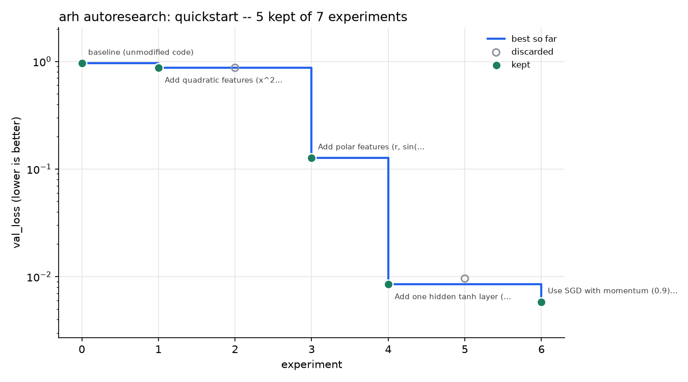

# autoresearch report: quickstart

- branch: `autoresearch/live` (isolated git mode)
- metric: `val_loss` (min)
- experiments: 7 (keep 5, discard 2, crash 0, invalid 0)
- baseline `0.960452` -> best `0.005833` (-99.4%)

## Kept improvements

| # | commit | val_loss | delta | description |
|---|---|---|---|---|
| 0 | `e61d2e5` | 0.960452 | - | baseline (unmodified code) |
| 1 | `5566387` | 0.872082 | -0.08837 | Add quadratic features (x^2, y^2, x*y) to allow simple non-linear boundaries; expect val_loss to drop since spirals need non-linear features. |
| 3 | `8a39750` | 0.126915 | -0.7452 | Add polar features (r, sin(theta), cos(theta)) to better capture spiral structure; expect val_loss to drop as model can use angular info. |
| 4 | `9cbd7e4` | 0.008474 | -0.1184 | Add one hidden tanh layer (16 units) with full-batch SGD to give non-linear capacity; expect val_loss to drop as MLP can better separate spirals. |
| 6 | `511a357` | 0.005833 | -0.002641 | Use SGD with momentum (0.9) instead of plain SGD; expect faster, more stable convergence and lower val_loss within the same time budget. |

## Every experiment

| # | status | metric | duration | description | reason |
|---|---|---|---|---|---|
| 0 | keep | 0.960452 | 3.1s | baseline (unmodified code) | baseline; holdout holdout_loss=0.896181 confirmed |
| 1 | keep | 0.872082 | 3.1s | Add quadratic features (x^2, y^2, x*y) to allow simple non-linear boundaries; expect val_loss to drop since spirals need non-linear features. | improved on 0.960452; holdout holdout_loss=0.800115 confirmed |
| 2 | discard | 0.872086 | 3.1s | Switch optimizer to Adam (with LR 0.01) for faster, more stable convergence vs plain SGD; expect val_loss to drop by better optimization | not better than best 0.872082 |
| 3 | keep | 0.126915 | 3.1s | Add polar features (r, sin(theta), cos(theta)) to better capture spiral structure; expect val_loss to drop as model can use angular info. | improved on 0.872082; holdout holdout_loss=0.084197 confirmed |
| 4 | keep | 0.008474 | 3.1s | Add one hidden tanh layer (16 units) with full-batch SGD to give non-linear capacity; expect val_loss to drop as MLP can better separate spirals. | improved on 0.126915; holdout holdout_loss=0.007628 confirmed |
| 5 | discard | 0.009589 | 3.1s | Add biases to both layers (b1, b2) and update them with SGD; expect small improvement because biases let the network shift activations and better fit the spiral patterns. | not better than best 0.008474 |
| 6 | keep | 0.005833 | 3.1s | Use SGD with momentum (0.9) instead of plain SGD; expect faster, more stable convergence and lower val_loss within the same time budget. | improved on 0.008474; holdout holdout_loss=0.010511 confirmed |
